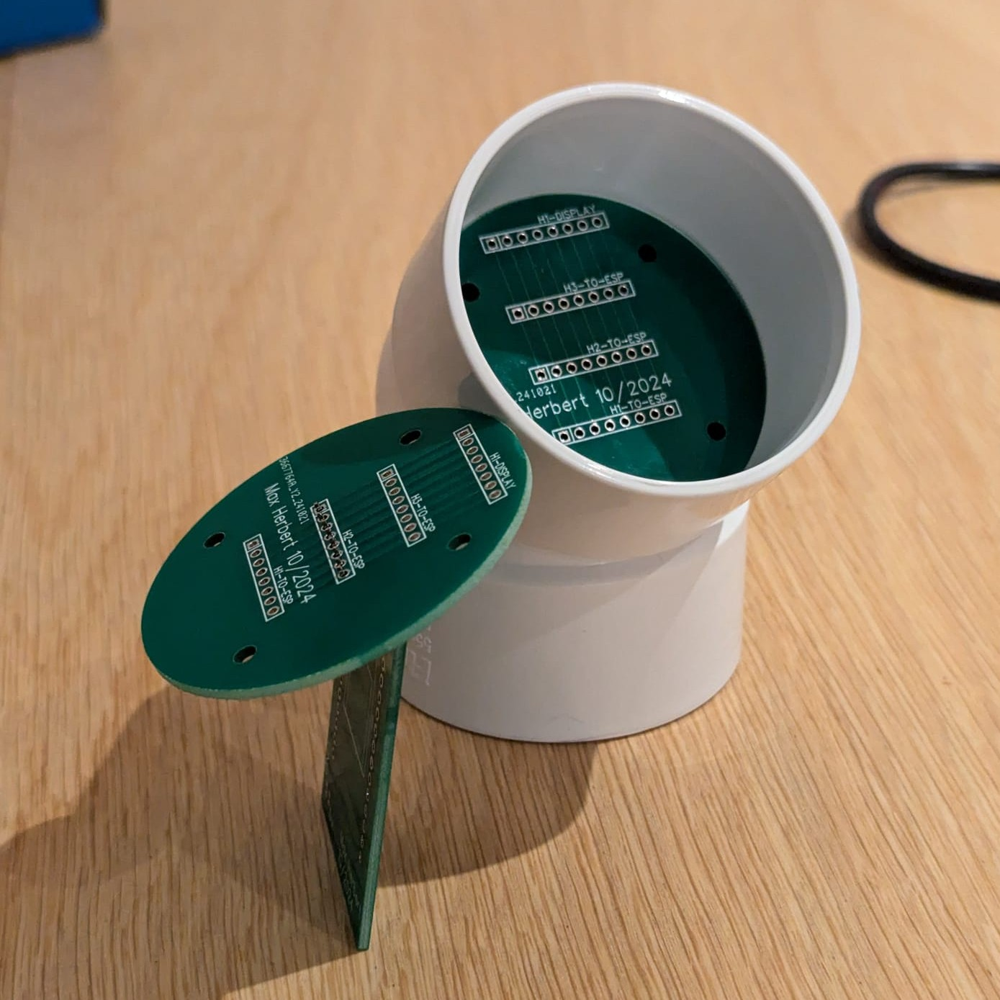
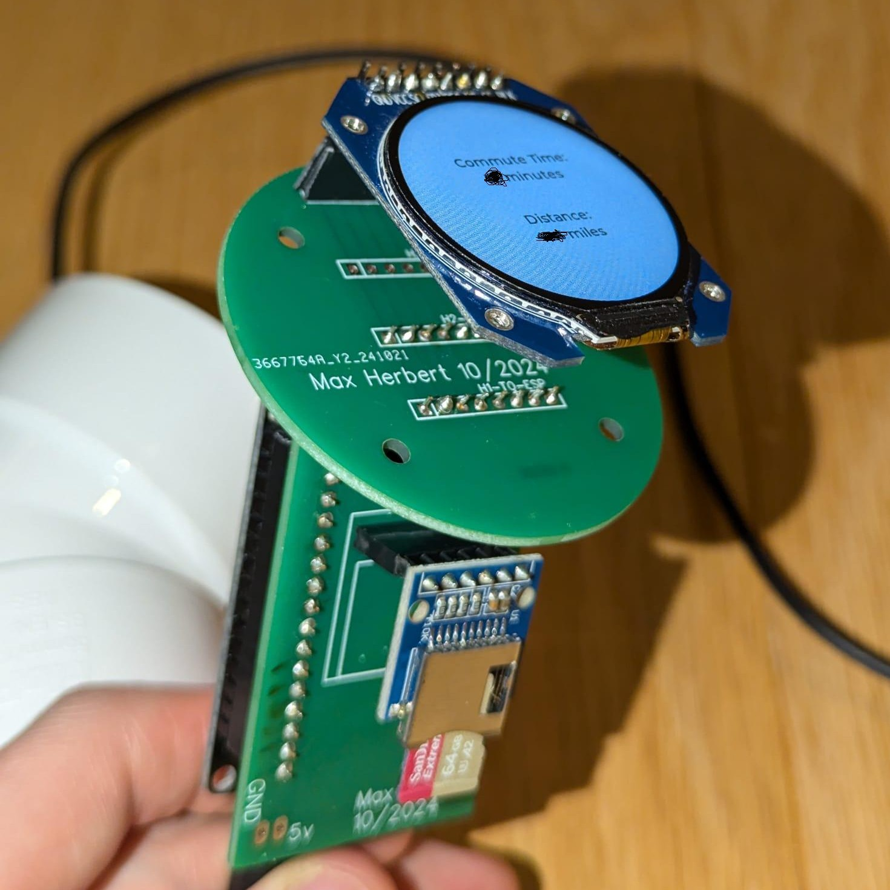

# Overview
All files involved in the development of a Desktop telemetry system, based on an ESP32. 
The project will involve an ornament displaying current commute time, weather information, and more. 


# Repository Structure
``` tree
├── config - This contains the files as they exist on the SD card.
│   ├── config.json - A template of the real config
│   └── etaApi
│       ├── headers.txt - templates of the http headers
│       └── postBody.txt - template of the http post body
├── dev/ - Several scripts involved in early dev.
│
│
│   # Module tests is used for active development
│   # Contains the source files for each function
│   # There is a main .ino, `config-manager.ion` 
│   # which is used to develop each function outside
│   # of the complicated main sketch enviroment.
│   # These are then moved into src when complete.
├── module-tests
│   └── config-manager
│       ├── config-manager.ino
│       └── src
│           │   # Each script relates to a single functionality
│           ├── ConfigManager.cpp   
│           ├── ConfigManager.h 
│           ├── EtaEstimator.cpp
│           ├── EtaEstimator.h
│           ├── WeatherMonitor.cpp
│           └── WeatherMonitor.h
├── README.md
├── requirements.txt # Pip requirements for some local testing
├── squareline-src/ # Src for squareline UI project
│ 
│   # Src is the directory of the final project
│   # UI is the main sketch, and as libraries are finished 
│   # in `module-tests`, they are moved in here.
└── src
    └── main
        ├── libraries
        ├── README.md
        ├── REDUNDANT
        └── ui
            ├── ui.ino   
            └── src
                ├── ConfigManager.cpp
                ├── ConfigManager.h
                ├── EtaEstimator.cpp
                ├── EtaEstimator.h
                ├── WeatherMonitor.cpp
                └── WeatherMonitor.h
```

# Status
              The Case                  |	                    Internals
:--------------------------------------:|:---------------------------------------------------:
 | 


# Required libraries
Python requirements are listed in the `requirements.txt` file.

Arduino requirements can be found in the following

- ArduinoJSON
- [lvlg](https://docs.lvgl.io/8.1/get-started/arduino.html#get-the-lvgl-arduino-library)
- [TFT_eSPI](https://github.com/Bodmer/TFT_eSPI)
- https://github.com/adafruit/Adafruit_GC9A01A/tree/main 
- https://github.com/adafruit/Adafruit-GFX-Library
- https://github.com/adafruit/Adafruit_BusIO/tree/master